Infrared-Serial</h1>
==========================================================================

**Read this in other languages: [English](README.md), [中文](README_zh.md).**
**其他语言版本: [English](README.md), [中文](README_zh.md).**

Infrared thermal imaging temperature measurement module
-------------------------------------------------------
User's Guide
------------

Please make sure to read this manual before using this module.

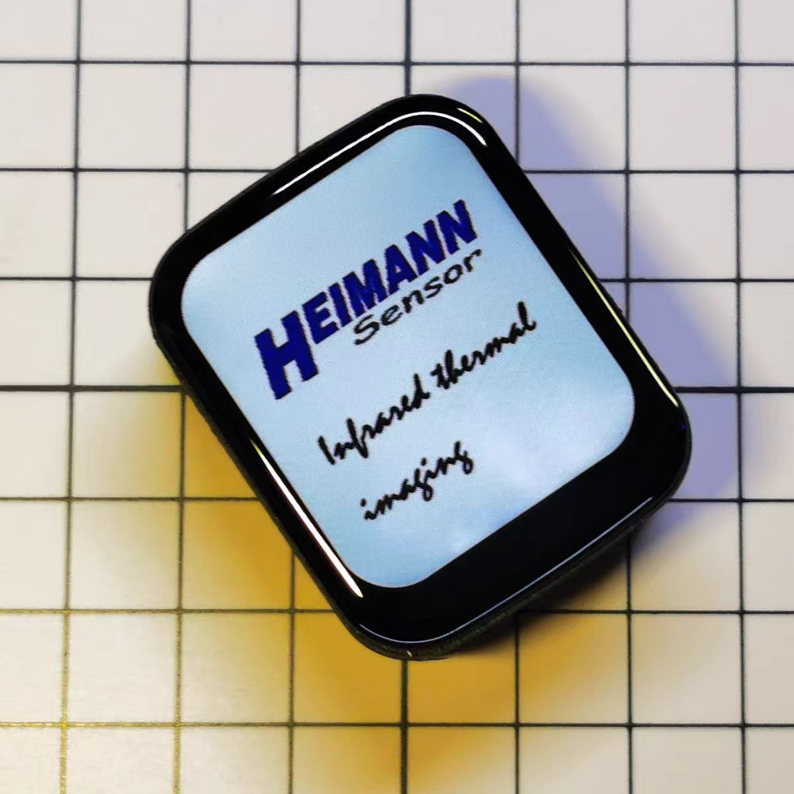

Infrared-pro

Touch screen and battery with all mini's function.

--------------------------------------------

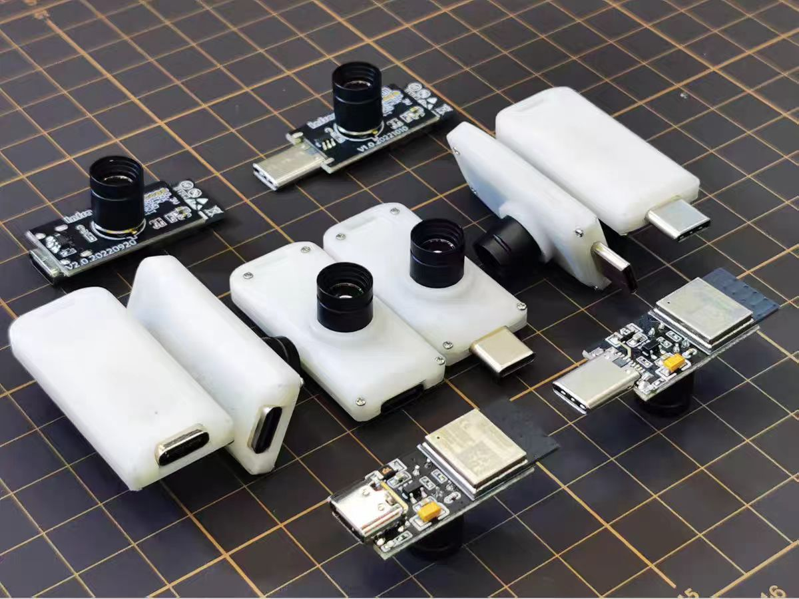

Infrared-mini

No screen, using WiFi screen cast. this for geeks only.

## Before using the module
Thank you for choosing “Infrared-Serial”, the infrared thermal imaging temperature measurement module. This manual explains how to operate the infrared thermal imaging temperature measurement module and the precautions that need to be observed during the operation. Please make sure to read this instruction manual before use.

**Please note:**
- This manual is protected by copyright law, without the written consent of the copyright owner, it is not allowed to copy or reproduce this manual all or part of the book. However, photocopies of this manual may be made for operating the equipment.
- The content of this manual may be changed at any time without notice.
- Welcome to correct the unclear semantics, errors, omissions or missing pages of this manual.
- Do not perform any operations on the equipment that are not mentioned in this manual, so as not to cause malfunction or accident.
- This module must not be used to endanger any wildlife.
- The company will not be responsible for the consequences caused by unauthorized operation.

## Product Introduction
### Application Scenario
The Infrared-Serial, is a 32\*32 pixel thermopile infrared array temperature measurement module with high performance and high-quality digital signals integrated with optical lenses. It can be widely used in human body temperature measurement, heat source tracking, experimental observation, circuit maintenance, robots and other scenarios.

The module has excellent platform compatibility and can run on Windows, Mac, Linux, Android, IOS , ROS and other operating systems, as long as the platform supports Wi-Fi and has a modern browser . And there is no need to download any APP, just open the browser to display the thermal imaging screen, bringing better display effect and interactive experience.

### Features
- Good system compatibility, it can run on Windows, Mac, Linux, Android, IOS , ROS , etc.
- Up to 5 clients can be displayed synchronously, and you can take a screenshot or record the screen to save the screen.
- The available Wi-Fi is automatically scanned. You only need to open the web page and enter the password to complete the network configuration.
- Provide up to 15 kinds of powerful algorithm support, bringing better display effect.
- Provide up to 31 kinds of display color schemes, each color scheme has different display effects, and the color scheme can be flipped.
- Support marking the highest temperature, the lowest temperature, and support fixed-point temperature measurement.
- Support the adjustment of emissivity to measure the temperature of objects more accurately.
- Supports gamma correction, which can enlarge the details of low temperature range or high temperature range.
- Supports the display the frame rate, and the average frame rate can reach 7.0 FPS.
- Supports the display of temperature curves for fixed-point and the download of temperature data, which is convenient for experimental observation.
- Supports calibrate temperature manually by setting slope and intercept.
- The screen supports left-right mirroring, up-down mirroring, and 360° rotation, which is convenient for installation or use at various angles.
- Supports automatic setting of temperature measurement range or manual adjustment of temperature measurement range.
- Firmware upgrade is supported.
- The ultra-small product size.
- The source code of the upper computer is provided, and the upper computer can be connected through USB and TCP, which is convenient for development.

### Environment
Please install it in a safe area without explosive or flammable gas, and the equipment has no explosion-proof grade.
Working environment: -20-85℃, humidity ≤95%RH, no frost.
Storage environment: -20-85℃, humidity ≤95%RH, no frost.

Warning:
Do not aim at the source of strong radiation Like welding arcs, sunlight, lasers! Otherwise, irreversible damage may be caused to the sensor!

### Performance Parameters
- Sensor pixels: 32*32 (1024 pixels)
- Field of view: 33°*33°
- Frame rate: 7.0 FPS
- Temperature range: -20°C to >1000°C
- Temperature measurement accuracy: For pixels within the radiation radius, take the larger value of "the difference between the target temperature and the ambient temperature multiplied by 3%" or "plus or minus 3 Kelvin"
- The farthest temperature measurement distance: depending on the size of the heating area, the temperature measurement of the human body can reach about 5m.

## Primary Usage
After this module is powered on, it’s works in AP mode, use your device to scan the surrounding Wi-Fi, you will see an open hotspot named "INFRAED- XXXXXX" in the Wi-Fi list.

 
Connect it. After the connection is complete, type http://192.168.4.1 into your browser, wait for the web page to load, and the thermal imaging screen will be displayed.

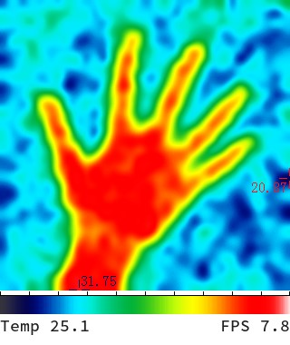

The bottom shows the average temperature and frame rate in the field of view. In the default mode, the cursor automatically finds the highest temperature and the lowest temperature in the screen as the temperature range, and automatically marking the positions of the highest temperature and the lowest temperature.

## Local Area Network
When your device is directly connected to the module, your device may not be able to access the Internet, so it is recommended that you use the module in Wi-Fi station mode. It can be connected to a router when used indoors, and can be connected to a mobile phone hotspot when used portable.

After directly connecting the module, open your browser and enter http://192.168.4.1/wifi to enter the network configuration page. At this point, a list of available Wi -Fis will be displayed on the web page.

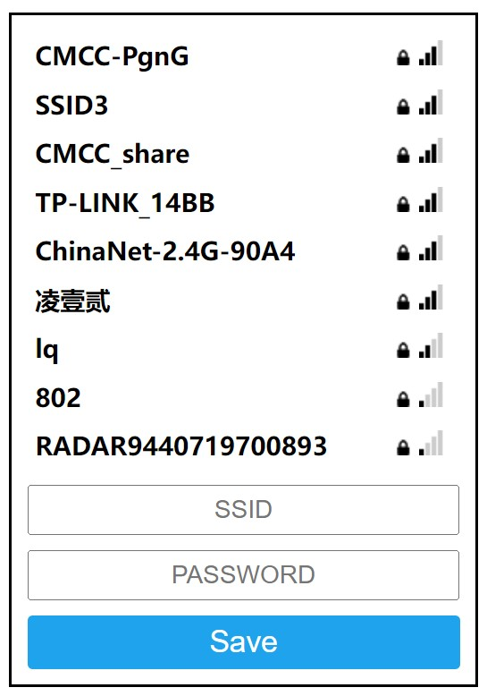

Please select the Wi-Fi which you want connect to, enter the password, click the “Save”, and when a notification pops up indicating that the network distribution is successful. 

The hotspot named as"INFRAED- XXXXXX" in your device will disappear after a few seconds. And a new hotspot named as "INFRAED-[IP ADDRDSS] " will be appear (but you can’t connect to it).
indicating that it has successfully connected to the Wi-Fi. Otherwise, the connection has failed.

You only need to configure the network once. If you want to change the configuration data later, you can reopen the configuration page to configure the network.

## Device Discovery
After the network configuration is completed, You have several ways to access it. Of course, the premise is that it is under the same local area network.

- In the last chapter we mentioned a new hotspot named as "INFRAED-[IP ADDRDSS]" will be appear when the module connect to a Wi-Fi, and you can use this "IP ADDRDSS" to access the webpage.

- If the device you are using supports the mDNS function, such as IOS, Mac, Windows (with chrome kernel browser), or devices with Android 12 system or above. You can directly enter http://infrared.local/ in your browser to access the module. If the device you are using does not support the mDNS function, you can access the device by installing mDNS software. mDNS function is not available when using the proxy software , it is recommended to try after closing the proxy software.

- If the module has screen, you can enter the setting page and scan the QR code to access webpage.
 
## Parameter setting
Press and hold any position on the thermal imaging screen for more than 2 seconds to enter the parameter setting page.

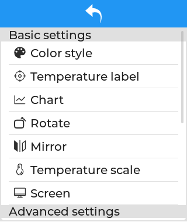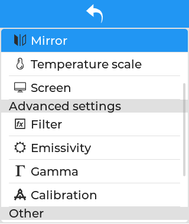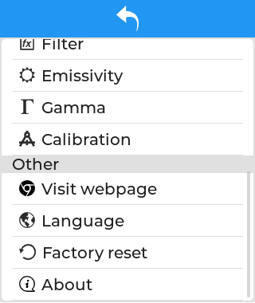

### Color style
In the infrared-Serial, different temperature levels are displayed as different colors, so that the temperature can be visually distinguished. This module supports up to 31 color schemes. And each scheme supports color flipping.

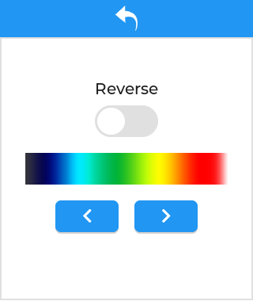

The figure below shows the display effect under different color schemes. There are too many color schemes, so we don’t want to show too much.

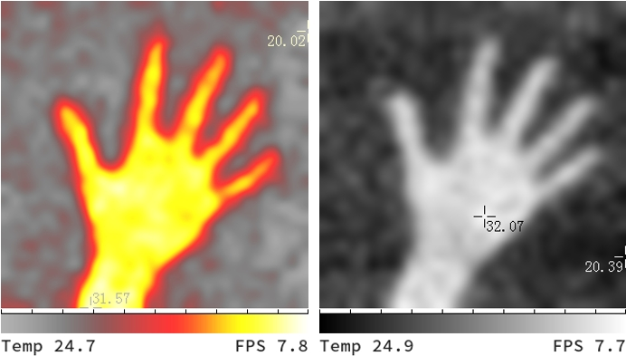

### Temperature Label
Coldest / Highest / Fixure temperature points in the screen can be highlighted, and the temperature can be displayed. Turning on the Fixure, tap a certain position on the main screen to display the temperature at that position. And the temperature will show in Chart.

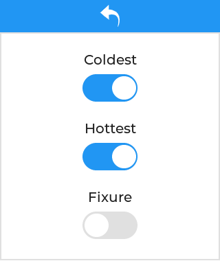

### Chart
This module supports the function of recording the temperature curve of a certain point in the screen. If the “Fixed measurement” is not enabled, the temperature at the center point of the screen will be recorded. If the “Fixure” function is enabled, the temperature curve of that point will be recorded. Temperature data can be reset or downloaded.

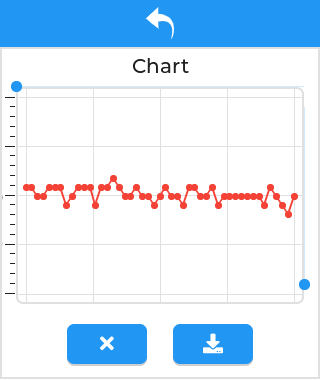

### Rotation / Mirror
The module supports horizontal mirroring, vertical mirroring, and 90°, 180°, 270° rotating images. It is convenient for you to install and use at all angles.

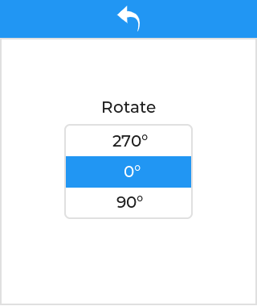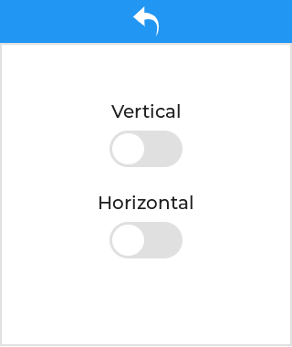

### Temperature Units
The module supports switching between 4 temperature scale, namely Celsius, Fahrenheit, Kelvin, and Rankine.

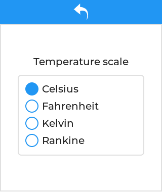

### Screen
You can use it to adjust the brightness of the screen and the amount of minute it automatically turns off . Of course, The premise is that you have a screen…

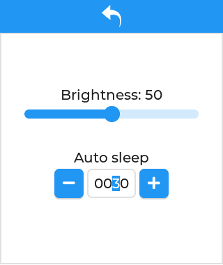

### Filter
The module provides up to 15 kinds of smoothing filters. Although the pixel of the sensor is only 32*32, the module has a built-in powerful algorithm to interpolate the picture to higher pixels through the smoothing filter to provide better display effect. Different smoothing filters have different display effects, which users can experience by themselves. Generally use the B-Spline filter.

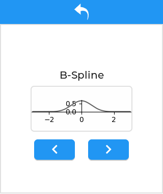

The following figure shows the display effect with different filter

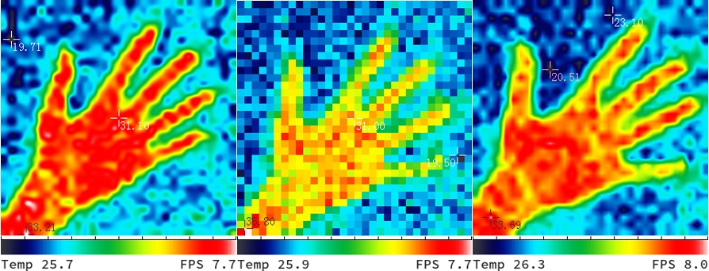

### Emissivity
Emissivity refers to the ratio of the energy radiated from the surface of an object to the energy radiated by a black body at the same temperature. (A black body is an idealized radiator that can radiate all energy, and its surface emissivity is 1.00) The emissivity of various substances is determined by the object's own material, surface roughness, surface geometry, shooting angle, It is determined by the wavelength and the temperature of the object itself (the material of the object itself is a factor that has the greatest influence on the emissivity of the object), so at the same temperature, different materials will radiate different energy.
Highly polished metal surfaces, such as copper or aluminum, typically have an emissivity below 0.10. Rough or oxidized metal surfaces have higher emissivity (0.6 or greater, depending on surface condition and amount of oxidation). Most flat paints are about 0.90, while human skin and water are about 0.98.

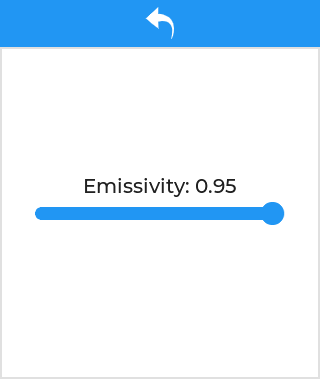

The module supports the adjustment of the emissivity, and the user can search for the emissivity of the object that needs accurate temperature measurement to achieve a better measurement effect.

### Gamma
Gamma correction is used to adjust the high temperature range or low temperature range of the temperature scale, so as to enlarge the details of the high temperature range or low temperature range, so as to achieve a better effect of finding the heat source.

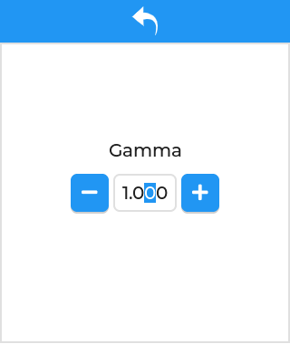

If the gamma parameter is enlarged, the details of the low-temperature range will be more obvious. If the gamma parameter is reduced, the details of the high-temperature range will be more obvious. The following figure shows the effect of adjusting the gamma parameter under the default color scheme, the left figure The gamma parameter of is 2.0, and the gamma parameter of the right picture is 0.5.

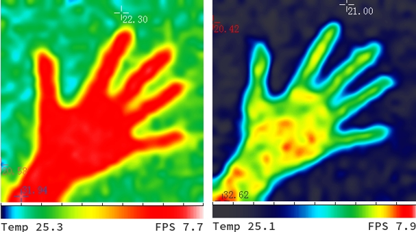

### Karman
By setting the Kalman filter to improve image quality stability, the smaller the parameter Q and the larger the parameter R, the higher the stability of the image. However, this leads to a poorer transient response to temperature changes, making it suitable for capturing stationary objects with minimal temperature variation. To reduce image quality delay, the Kalman filter is turned off by default (if either Q or R is set to 0, the filter is disabled). The recommended parameters are: [Q: 1.0, R: 0.5].

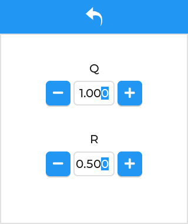

### Calibration
The temperature measured by thermal imaging is for reference only. It will be affected by various factors in actual use. The module supports manual adjustment of intercept and slope . If the user has the conditions to measure the real temperature curve of the object to be measured and the thermal imaging module in the corresponding situation In the temperature curve, the temperature curve of the two can be fitted to a straight line by the least square method, and then the slope and intercept can be set so that the temperature measurement straight line of the thermal imaging module is basically consistent with the real temperature straight line, and the calibration can be completed.(For example, if the measured temperature is 1 degree lower than the actual temperature, the intercept is set to +1, and if it is 1 degree higher, it is set to -1. The slope generally does not need to be set.)

In addition, individual pixels may have some temperature drift. This deviation can be calibrated by shielding the sensor with an object with a consistent temperature and clicking the “Calibration” button.

### Visit webpage
When your device and this module are in the same LAN, You can access the website by scanning the QR code. This page will also display the SSID and IP address.

The slider below the QR code indicates how long it will take for the WiFi to be automatically turned off if there is no WiFi connection. Turning on WiFi will increase heat and power consumption.

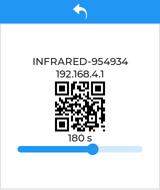

### Language
This module supports several languages, you can switch to the language you are familiar with.

  
### Factory reset
Long press this button to do a factory reset and reboot.

### So where can buy it?
Please scan the QR code below or click the link below to go directly to the official store ^^

  <a href="https://shop237247974.taobao.com/" target="_blank">Click here to go directly to the link 🚀</a>

### Other
**If you are a developer and want to do secondary development, please read the developer manuals: [Developer Manauals](develop/README.md)**

### Contact
E-mail: chenqt123@qq.com