Infrared-Serial</h1>
==========================================================================

**Read this in other languages: [English](README.md), [中文](README_zh.md).**
**其他语言版本: [English](README.md), [中文](README_zh.md).**

红外热成像测温模块
-------------------------------------------------------
用户手册
------------

在使用此模块之前，请务必阅读本手册。

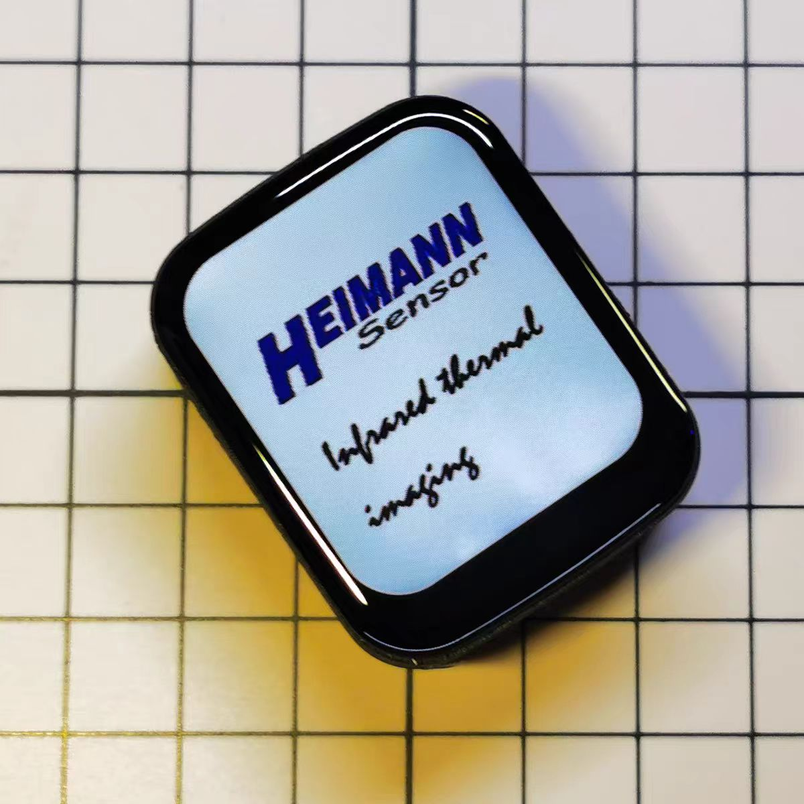

Infrared-pro

拥有触摸屏和电池，且具有所有mini的所有功能

-------------------------

Infrared-mini

没有屏幕，使用WiFi投屏，仅限极客使用

## 在使用模块之前
感谢您选择红外热成像测温模块"Infrared-Serial"。本手册介绍了红外热成像测温模块的操作方法以及操作过程中需要注意的注意事项，请务必在使用前阅读本使用说明书。

**请注意:**
- 本手册受版权法保护，未经版权所有者书面同意，不得复制或复制本手册的全部或部分内容。但是，可以复印本手册以操作设备。 
- 本手册的内容可能随时更改，恕不另行通知。 
- 欢迎更正本手册中不清楚的语义、错误、遗漏或缺失的页面。 
- 请勿对本手册中未提及的设备进行任何操作，以免引起故障或事故。 
- 此模块不得用于危害任何野生动物。 
- 未经授权操作所造成的后果，本公司概不负责。

## 产品介绍
### 应用场景
Infrared-系列产品，是一款集成光学透镜的高性能、高质量数字信号的32*32像素热电堆红外阵列测温模块。可广泛应用于人体测温、热源追踪、实验观察、电路维修、机器人等场景。

### 产品特征
- 该模块具有出色的平台兼容性，可以运行在Windows、Mac、Linux、Android、IOS、ROS等操作系统上，只要平台支持Wi-Fi，并且有现代浏览器。并且无需下载任何APP，只需打开浏览器即可显示热成像画面。
- 最多可同步5个客户端显示，并且可以截图或者录屏保存屏幕。
- 自动扫描可用的Wi-Fi，只需要打开网页输入密码即可完成配网。
- 提供多达十余种强大的算法支持，带来更好的显示效果。
- 提供多达几十种显示配色方案，每种配色方案都有不同的显示效果，配色方案可翻转。
- 支持标记最高温度、最低温度，支持定点测温。
- 支持发射率调节，更精准测量物体温度。
- 支持伽马校正，可放大低温区或者高温区细节。
- 支持显示帧率，平均帧率可达7.0FPS。
- 支持定点温度曲线显示和温度数据下载，方便实验观察。
- 支持通过设置斜率和截距手动校准温度，支持自动校准传感器误差。
- 屏幕支持左右镜像、上下镜像、360°旋转，方便各种角度安装或使用。 
- 支持自动设置测温范围或手动调整测温范围。 
- 支持固件升级。 
- 超小的产品体积。 
- 提供上位机源码，可通过USB、TCP连接上位机，方便开发。

### 使用环境
请安装在无爆炸性、易燃气体的安全区域，设备无防爆等级。工作环境：-20-85℃，湿度≤95%RH，无霜冻。存储环境：-20-85℃，湿度≤95%RH，无霜冻。

警告：请勿瞄准强辐射源，如焊接电弧、阳光、激光和强电离环境！否则，可能对传感器不可逆转的损害!

### 性能参数
- 传感器像素：32*32（即1024个像素点） 
- 视场角：33°*33° 
- 帧率：7.0 FPS 
- 温度范围：-20°C 至 &gt;1000°C
- 测温精度：对于辐射半径内的像素，取“目标温度与环境温度之差乘以3%”或“正负3开尔文”中的较大值 
- 最远测温距离：根据发热面积大小，人体测温可达5m左右。

## 使用方式
该模块通电后，工作在AP模式，使用您的设备扫描周围的Wi-Fi，您将在Wi-Fi列表中看到一个名为“INFRAED- XXXXXX”的开放热点。

连接上，连接完成后在浏览器中输入[http://192.168.4.1](http://192.168.4.1)，等待网页加载完成，即可显示热成像画面。

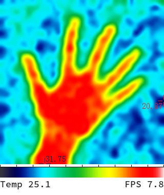

下方显示芯片的温度和热成像画面的刷新帧率，默认模式下光标自动寻找屏幕内最高温度和最低温度作为温度范围，并自动标注出最高温度和最低温度的位置。

## 局域网连接
当您的设备直接连接模块时，您的设备可能无法上网，所以建议您以WiFi station模式使用模块，在室内使用时可以连接路由器，便携使用时可以连接手机热点。

直连模块后，打开浏览器输入[http://192.168.4.1/wifi](http://192.168.4.1/wifi)，进入网络配置页面，此时网页上会显示可用的Wi-Fi列表。

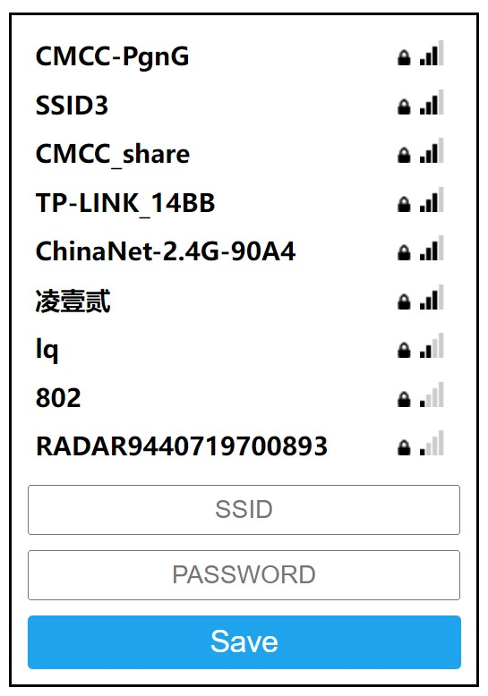

请选择要连接的Wi-Fi，输入密码，点击“保存”，弹出网络分配成功的提示。

设备中名为“INFRAED- XXXXXX”的热点会在几秒后消失，并会出现一个名为“INFRAED-[IP ADDRDSS] ”的新热点（但无法连接），表示已成功连接到 Wi-Fi，否则连接失败。

您只需配置一次网络，之后如果想更改配置数据，可以重新打开配置页面重新配置网络。

## 设备发现
网络配置完成后，您可以通过多种方式进行访问。当然前提是在同一局域网下。

- 在上一章中我们提到，当模块连接上Wi-Fi后，会出现一个名称为“INFRAED-[IP ADDRDSS]”的新热点，您可以通过这个“IP ADDRDSS”来访问网页。

- 如果您使用的设备支持mDNS功能，如IOS、Mac、Windows（带chrome内核浏览器），或者Android 12以上系统的设备，可以直接在浏览器中输入[http://infrared.local](http://infrared.local) 来访问模块。如果您使用的设备不支持mDNS功能，可以通过安装mDNS软件来访问设备。使用代理软件时mDNS功能不可用，建议关闭代理软件后再尝试。

- 如果模块有屏幕，可以进入设置页面，扫描二维码访问网页。

## 参数设置
长按热像屏幕任意位置2秒以上，进入参数设置页面。

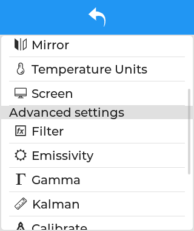

### 色彩风格
不同的温度以不同的颜色显示，从而可以直观的区分温度。本模块最多支持多种配色方案。每种方案都支持颜色翻转。

下图是不同配色方案下的显示效果，配色方案太多了，就不展示太多了。

### Temperature Label
屏幕上最低 / 最高 / 固定点测温点可以高亮显示，并显示温度。打开固定点测温，点击主屏幕上的某个位置，显示该位置的温度。温度将显示在温度曲线中。

### 温度曲线
本模块支持记录屏幕某一点温度曲线的功能，若不开启“固定测量”，则记录屏幕中心点的温度，若开启“固定点测温”功能，则记录该点的温度曲线。温度数据可重置或下载。

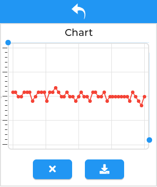

### 旋转/镜像
模块支持水平镜像、垂直镜像、以及90°、180°、270°旋转图像，方便您各个角度的安装使用。

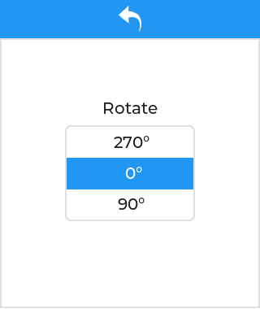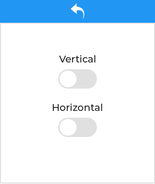

### 温度单位
该模块支持4种温标切换，分别是摄氏度、华氏度、开尔文、兰氏度。

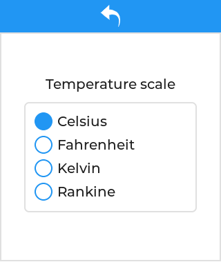

### 屏幕
你可以用它来调整屏幕的亮度和自动息屏的分钟数。当然，前提是你有一个屏幕……

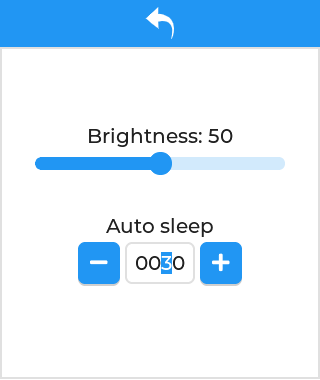

### 滤波器
模块提供多达十余种平滑滤波器，虽然传感器的像素只有32*32，但模块内置强大的算法，通过平滑滤波器将图片插值到更高的像素，以提供更好的显示效果。不同的平滑滤波器显示效果不同，用户可以自行体验。一般使用B-Spline滤波器。

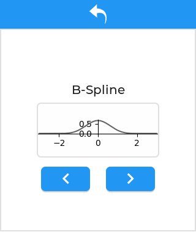

下图是使用不同滤镜后的显示效果

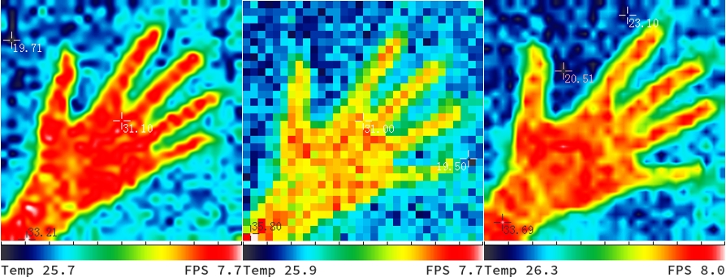

### 发射率
发射率是指物体表面辐射出去的能量与相同温度下黑体辐射出去的能量之比。（黑体是能辐射出全部能量的理想化的辐射体，它的表面发射率为1.00）各种物质的发射率是由物体本身的材质、表面粗糙度、表面几何形状、拍摄角度、波长以及物体本身的温度共同决定的（物体本身的材质是对物体发射率影响最大的因素），所以在相同温度下，不同的物质会辐射出不同的能量。高度抛光的金属表面，如铜或铝，一般发射率在0.10以下。粗糙或氧化的金属表面发射率较高（0.6或更大，取决于表面状况和氧化程度）。大部分平光漆约为0.90，而人体皮肤和水约为0.98。

模块支持发射率的调节，用户可以根据需要精准测温的物体的发射率进行查找，以达到更好的测量效果。

### 伽马校正
利用伽马校正来调整温标的高温范围或者低温范围，从而放大高温范围或者低温范围的细节，以达到更好的寻找热源的效果。

如果将伽马参数放大，低温区的细节会更加明显，如果将伽马参数减小，高温区的细节会更加明显，下图是默认配色方案下，调整伽马参数的效果，左图的伽马参数为2.0，右图的伽马参数为0.5。

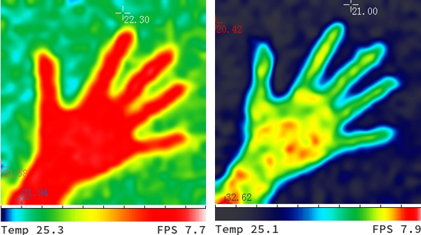

### 卡尔曼滤波器
通过设置卡尔曼滤波器来提升图像画质稳定性，参数Q越小，R越大，图像的稳定性越高，但是对温度变换的瞬态响应就越差，适合用来拍摄固定且温度变化不大的物体，为了降低画质的延迟，卡尔曼滤波器默认关闭（Q或R任意一个为0则关闭卡尔曼滤波器），推荐的参数为：[Q: 1.0，R: 0.5]。

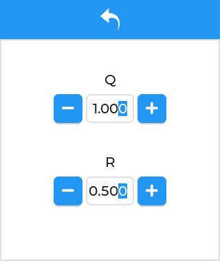

### 传感器校准
热像测量的温度仅供参考，实际使用中会受到各​​种因素的影响，模块支持手动调整截距和斜率，如果用户有条件在对应情况下测得待测物体的真实温度曲线和热像模块的温度曲线，可以用最小二乘法将二者的温度曲线拟合成一条直线，然后设置斜率和截距，使得热像模块的测温直线与真实温度直线基本一致，即可完成校准。

此外，个别像素可能会出现一些温度漂移。可以通过用温度一致的物体遮挡传感器并点击“校准”按钮来校准这种偏差。

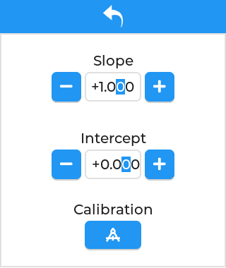

### 访问网页
当您的设备和本模块在同一个局域网内时，您可以通过扫描二维码来访问网站，此页面还会显示 SSID 和 IP 地址。

二维码下方的滑块表示在没有 WiFi 连接的情况下，多久后会自动关闭 WiFi。开启 WiFi 会增加热量和功耗。

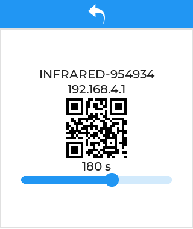

### 语言设置
该模块支持若干种语言，您可以切换到您熟悉的语言。

  
### 恢复出厂设置
长按此按钮可恢复出厂设置并重新启动。

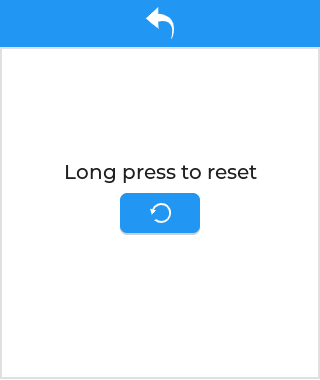

### 其他
**如果你是开发者，想要进行二次开发，请阅读开发者手册: [开发者手册](develop/README.md)**

### 联系方式
E-mail: chenqt123@qq.com
