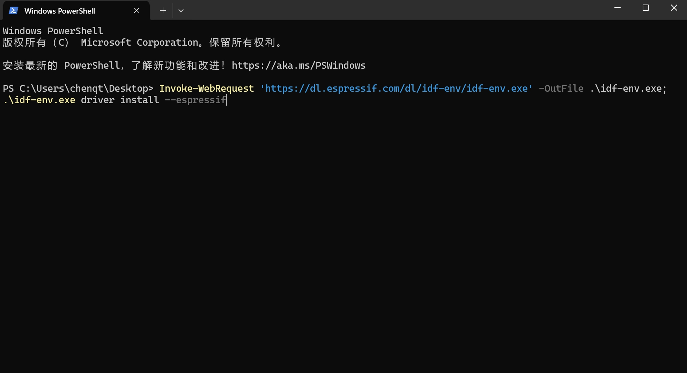
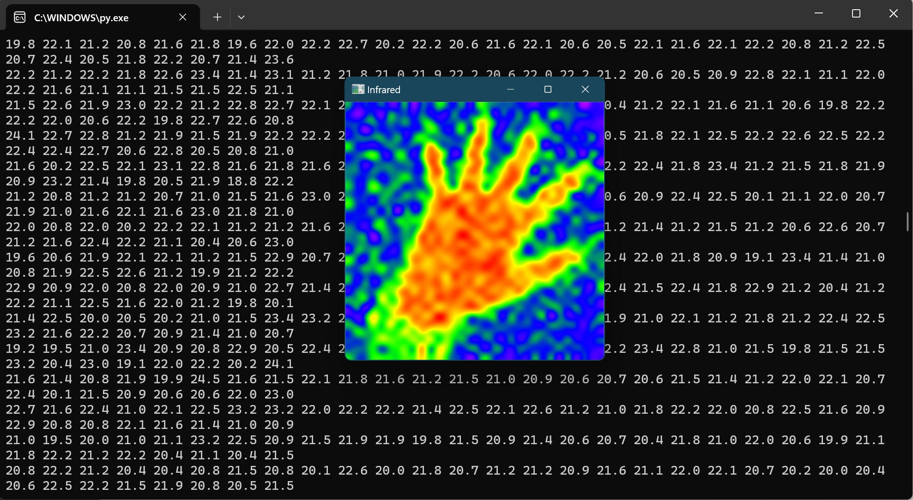

Infrared-Serial</h1>
==========================================================================

红外热成像测温模块
-------------------------------------------------------
开发者手册
------------

## 1. 驱动安装
如果您使用的是 Windows，则可以打开 Powershell 并输入以下命令并按回车，一路确认即可:
Invoke-WebRequest 'https://dl.espressif.com/dl/idf-env/idf-env.exe' -OutFile .\idf-env.exe; .\idf-env.exe driver install --espressif

如果驱动安装成功，插入红外模块后，您将在设备管理器中看到对应的 COM 设备。
您也可以在固件包中找到驱动。

如果您使用的是其他系统，则无需安装驱动

## 2. 设备交互
数据包以MsgPack格式序列化（MsgPack数据包前会有16个字节用来指示数据包类型和长度和CRC校验，用于处理粘包和校验错误的情况），解析的步骤可以参考vision目录下的代码，上位机的代码需要配合一同发布的固件使用。

vision目录中的代码提供了一种将温度数据渲染热成像图的方案，请自行参考，代码中注释详细，逻辑也很简单，如果您看不懂，别问，自己下去好好沉淀沉淀。

可以使用TCP连接模块，TCP连接时仅支持MsgPack格式的RPC通信数据。如果您希望在前端中展示热成像画面，建议在本地搭建服务器转发。

## 3. 固件升级
固件版本号可以在About页面中查看，如果您希望升级版本，找到对应产品目录的frimware目录，安装驱动后双击update.exe，如果您使用的是非Windows系统，需要支持python环境，执行对应的update.py脚本，等待升级完成即可。升级后不保证原先的配置还在。若升级后出现异常，请联系客服处理。
